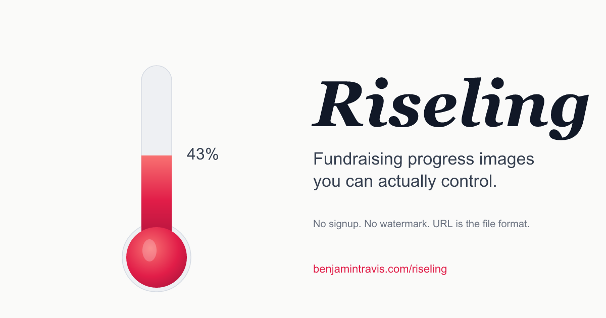

<div align="center">
  
</div>

# Riseling

**Fundraising progress images you can actually control.**
Any currency, any unit, shareable by link.

**[→ Try it live](https://benjamintravis.com/riseling/)**

---

## What it is

A browser tool for generating fundraising progress graphics, client-side.
Pick a shape, set a goal and a raised amount, type a title, choose colors
and a font theme. The preview updates as you type. Download a PNG, copy a
link, or embed an iframe.

The whole config encodes into the URL, so every preview doubles as a
shareable link. Bookmark it, paste it into a doc, send it to a teammate.
They see what you see. Nothing is uploaded.

Six shapes ship today: **thermometer, horizontal bar, progress ring, jar,
heart, battery.** All shapes use the same controls, so switching between
them is instant.

---

## Why it exists

The fundraising thermometer generators that already exist are mostly
one-shot tools. Type a goal, click generate, get a static image. Most
handle US dollars only. A few add a watermark. None of them let you embed
the result.

I wanted a live configurator. Pick the shape, the colors, the font.
Type the numbers. Watch the meter update. Download a clean PNG that
matches the preview, font and all. Paste a link to a teammate and have
them open the exact same configuration. Drop an iframe into a campaign
page. Track meals served, miles run, books donated, or any other unit
that isn't dollars.

That tool didn't exist, so this one does.

---

## What's in it

**Six meter shapes.** Thermometer, horizontal bar, progress ring, jar,
heart, battery. All gradient-filled with subtle highlights. Visual picker
in the editor.

**Three tracking modes.** Currency mode (21 locale-aware presets via
`Intl.NumberFormat`). Custom-unit mode for free-text labels (books,
miles, meals). Impact-unit mode for the "$250 = 1 counseling session"
reframing, where the meter fills in units instead of dollars.

**Six font themes.** System sans, Editorial (Fraunces + Inter, default),
Serif Display (Instrument Serif), Modern (Space Grotesk), Classic
(Playfair Display), Mono (JetBrains Mono). Self-hosted via `@fontsource`
and embedded into PNG exports as base64 woff2 so the download matches
the preview, not your system fallback.

**URL-encoded state.** Every config is a shareable link. `?s=ring&g=10000&r=4500&t=...`
restores the exact view. The schema version is locked at `v=1` for
forward compatibility.

**A read-only viewer route.** `https://benjamintravis.com/riseling/v/?...`
renders the meter without controls. Useful for sharing a clean view, or
embedding it.

**An embed modal.** Generates a copy-pastable iframe snippet with width,
height, background, and an optional "Edit in Riseling" link. Hosts get
auto-resize via a `postMessage` height handshake.

**Export presets.** Native PNG, IG Story 1080×1920, Square 1080×1080,
Social card 1200×630, Print B&W-safe at 300dpi grayscale, raw SVG.

**Live spring-animated fill** when raised or goal values change.

**Show/hide toggles** for title, caption, raised number, goal line, and
percentage label, in case you want a minimal version.

**No signup. No watermark. No upload.** Everything runs in the browser.

---

## Stack

- [React 19](https://react.dev) + [Vite 8](https://vitejs.dev) + [TypeScript 6](https://www.typescriptlang.org)
- [Tailwind v4](https://tailwindcss.com) via the Oxide plugin
- [nuqs](https://nuqs.47ng.com) for URL-synced state
- [@fontsource](https://fontsource.org) for self-hosted webfonts
- `Intl.NumberFormat` for locale-aware currency formatting
- Native SVG → Canvas for PNG export (no DOM-capture deps)
- Multi-entry Vite build for the editor (`/`) and viewer (`/v/`) routes
- GitHub Pages deployment via Actions

---

## Run it locally

```bash
npm install
npm run dev
```

Open `http://localhost:5173/riseling/`

---

made by [btrav](https://github.com/btrav)
